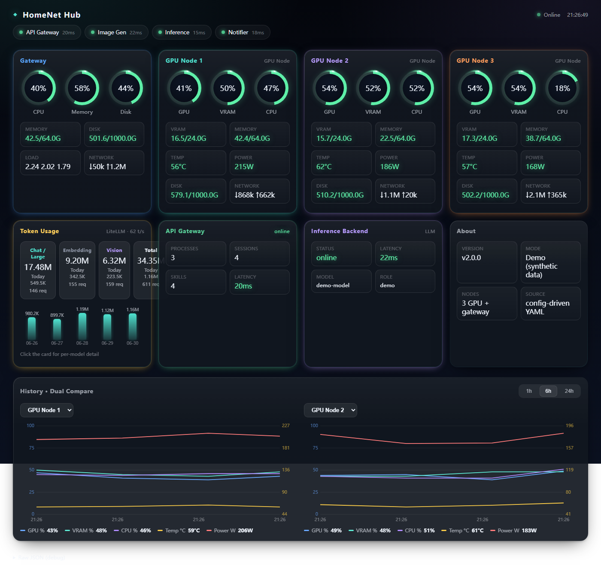

# HomeNet Hub

A **config-driven, self-hostable home-lab monitoring dashboard**. Point it at your
machines and services with a few lines of YAML — no code changes, no rebuilds.
Clone it and it boots straight into a live **demo with synthetic data**, so you can
see the whole thing working before wiring up anything real.



> All display text (titles, labels, categories, theme) is configuration — write it
> in **any language**. The shipped example is English; your `config/` is yours.

---

## Features

- **Config-driven** — add a machine/service by editing YAML; the card appears on save.
- **Zero-config demo** — runs out of the box with synthetic data (no backend, no secrets).
- **Hot-reload** — edit YAML on the host; the panel re-shapes within ~3 s. A bad edit is
  rejected and the previous good config stays live (the panel never goes dark).
- **Collectors** — `http` (pull), `http_push` (machine pushes to you), `sql` (read-only
  Postgres), `exec` (allowlisted local commands), `demo` (synthetic).
- **SQLite time-series** — built-in history with dual-pane compare charts.
- **Themeable** — fonts, background, card surface, status colors via `theme.yaml`.
- **Single container** — `docker compose up` and you're done.

---

## Quick start

```bash
git clone https://github.com/bevanho777-max/HomeNet-Hub.git
cd homenet-hub

# (optional) start from the example config — the app also falls back to it automatically
cp -r config.example/* config/
cp .env.example .env

docker compose up -d --build
# open http://<host>:3100
```

That's it — you'll immediately see the **demo dashboard** with animated synthetic data.
Nothing in `.env` is required for the demo; you only fill it in when you connect a real
backend.

### Run locally without Docker

```bash
npm install
npm start          # http://127.0.0.1:3100   (set PORT to change)
```

---

## Configure for your environment (self-hosting)

Real config lives in `config/` (git-ignored). If a file is missing there, the app falls
back to `config.example/`. Copy the examples and edit:

```bash
cp -r config.example/* config/
```

### `targets.yaml` — your machines & services

Each target declares **how to collect** (`source`) and **how to map** the raw JSON into
metric keys (`map`, via JSONPath). To go live, replace a demo source with a real one — the
`map` stays the same.

| source | use |
|---|---|
| `demo` | synthetic data (default in the example) |
| `http` | pull a machine's report endpoint, e.g. `http://gpu-node-1.example.local:9100/report` |
| `http_push` | the machine POSTs to `POST /api/push/:id` with header `X-Push-Token` == its `token_env` |
| `sql` | read-only Postgres; query comes from `queries/*.sql` only |
| `exec` | local allowlisted command (`sysreport_local` / `ping_host` / `probe_telegram`) |

```yaml
- id: gpu1
  name: "GPU Node 1"
  badge: "RTX 4090"
  source: { type: http, url: "http://gpu-node-1.example.local:9100/report", interval: "1.5s" }
  map:
    gpu: "$.gpu"
    vram_pct: "$.vram.pct"
    vram_bytes: { v: "$.vram.used_g", max: "$.vram.total_g" }
    gpu_temp: "$.gpu_temp"
    gpu_power: "$.gpu_power"
```

> **First thing to do when connecting real data:** align the `map` JSONPaths (`$.vram.pct`
> …) to whatever JSON your report endpoint actually emits. That's the knob the whole design
> exists to turn.

### `classify` — bucket tokens by model (sql/demo token target)

Token rows (raw `model` names) are bucketed into display categories by regex — entirely in
config, so you re-categorize without touching SQL:

```yaml
classify:
  by: model
  rules:
    - { name: "Chat / Large", match: { regex: "chat|instruct|[0-9]{2,}b" }, color: "#4fe3d0" }
    - { name: "Embedding",    match: { regex: "embed|bge" },                 color: "#8b93a3" }
    - { name: "Vision",       match: { regex: "vl|vision" },                 color: "#b89cff" }
  fallback: { name: "Other", color: "#8b93a3" }
```

### `layout.yaml` — cards & presentation

- **Add/remove cards** by editing the `grid` list. Card types: `machine`, `token`,
  `service`, `history`, and the generic **`info`** card (a pure label/value list — add any
  "info box" with no code).
- **`token.front_max`** — how many category boxes show on the token card front (default 3);
  the detail modal always lists all categories.
- Section titles, the status-bar pills, history ranges, and all chrome text are config.

### `theme.yaml` — appearance

Fonts, page background, card surface, and status colors (`ok`/`warn`/`danger`/`cool`). The
shipped defaults equal the built-in look exactly, so an unmodified theme is pixel-identical;
change a value and the panel updates on reload.

### `metrics.yaml` — metric templates (i18n lives here)

Defines each metric's `label` / `unit` / `thresholds` / `format`. Labels are free text in
**any language** — this is where you localize the dashboard.

### `.env` — secrets

- `PG_DSN` — read-only Postgres DSN for `sql` token collectors.
- `PUSH_TOKEN_<NAME>` — shared secret per `http_push` target (name matches its `token_env`).
- `TELEGRAM_BOT_TOKEN` — optional, for the `probe_telegram` exec command.

---

## Security

- **exec** runs only built-in allowlisted commands; config can reference a name and pass
  validated args (`ping_host` requires a private RFC1918 address). Arbitrary command strings
  are never accepted.
- **sql** is read-only, SQL comes only from `queries/*.sql`, and the single bound parameter
  is an integer. No config- or client-supplied SQL is ever executed.
- **http_push** requires a matching `X-Push-Token`; unknown/invalid tokens are rejected.
- **Secrets** (`PG_DSN`, push tokens) live in `.env`; `config/`, `data/`, and `.env` are
  git-ignored. `config.example/` is safe to publish.
- **Exposing to the internet:** put it behind a reverse proxy with authentication. The app
  has no auth of its own and is intended for a trusted LAN or an authenticated proxy.

---

## Architecture

```text
collectors (per-target interval; http / http_push / sql / exec / demo)
   → normalize  (JSONPath map + metric templates → value / level / display)
   → snapshot   (in-memory latest)            → GET /api/snapshot
   → tsdb       (SQLite time-series)          → GET /api/history
config/*.yaml — chokidar watch + ajv validation → GET /api/config (etag)
web/ — vanilla frontend renders from /api/config + /api/snapshot
```

| method | path | |
|---|---|---|
| GET | `/api/config` | merged, sanitized config (no secrets); `ETag` for re-render-on-change |
| GET | `/api/snapshot` | latest normalized metrics per target |
| GET | `/api/history?target=&metric=&range=1h\|6h\|24h` | time-series points |
| GET | `/api/token_detail?range=24h\|7d\|30d` | by-model token breakdown |
| POST | `/api/push/:targetId` | http_push receiver (token-checked) |
| GET | `/healthz` | liveness + config health |

Config is bind-mounted read-only into the container, so you edit YAML on the host and the
running container hot-reloads it. SQLite lives on the `./data` volume.

---

## License

[MIT](LICENSE).
