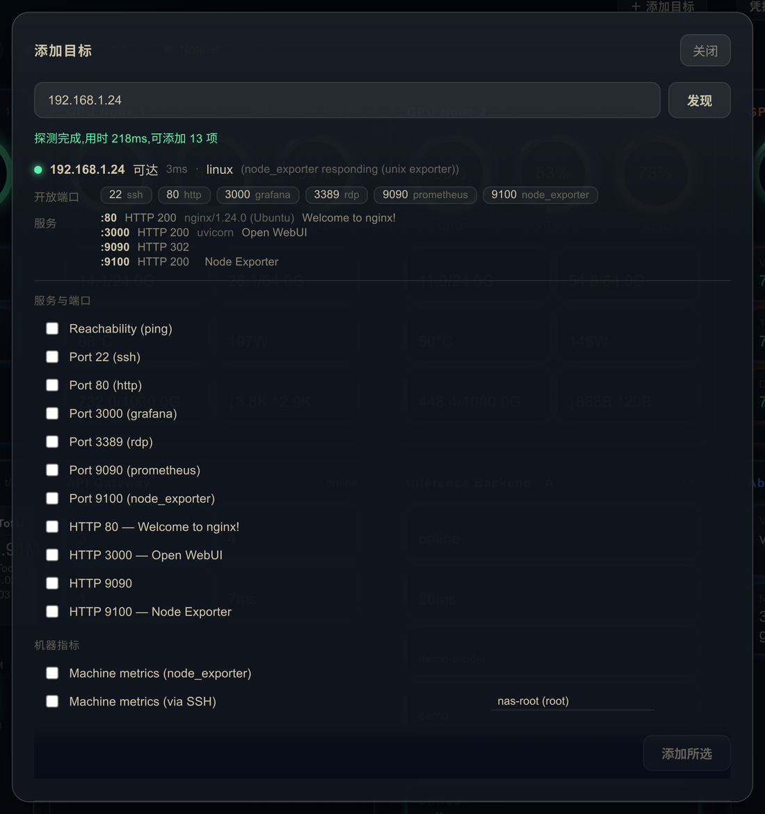
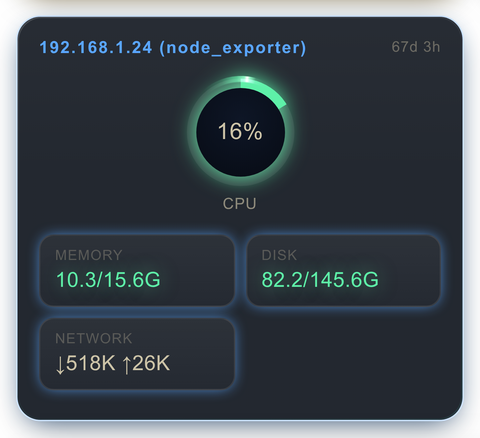
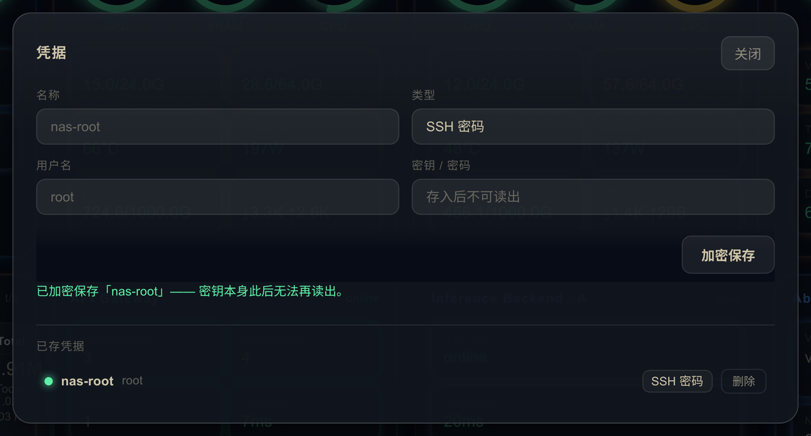
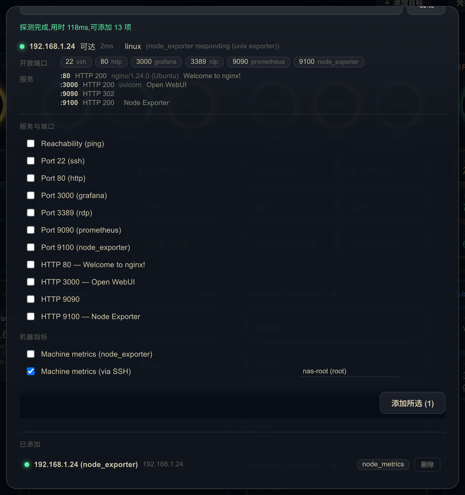
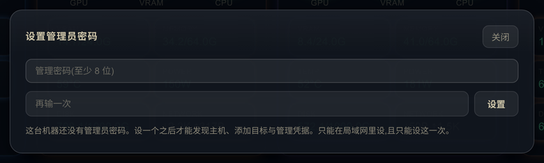

# HomeNet Hub

[English](README.md) · **简体中文**

一个**配置驱动、可自托管的局域网监控面板**。用几行 YAML 就能把机器和服务接进来——
或者干脆输一个 IP,让面板自己去发现那台机器上有什么。clone 下来即可启动进入带
**合成数据的实时 demo**,先看到整套效果再接真实后端。


> 所有展示文案(标题、标签、分类、主题)都来自配置,可用**任意语言**书写。仓库自带示例是
> 英文;你的 `config/` 归你自己。

---

## 核心特性

- **配置驱动** — 加一台机器/服务只需改 YAML,保存即出卡;没有任何写死。
- **发现 → 加 → 看见** — 输入一个私网 IPv4,面板去探这台机器上有什么,然后列出这些发现
  能支撑的能力。勾选,它们就变成真正的 target 和卡片,存进数据库而不是只读挂载的 YAML。
  这一层**完全不需要凭据**。
- **机器指标:零凭据 / 凭据式两条路** — 跑着 **node_exporter** 的机器,一次抓取就是一张
  完整机器卡,全程没有任何密钥;只开了 **SSH** 的机器,一次会话产出同样的卡,密码或私钥
  存在加密金库里。(WinRM/Windows 已在能力目录中登记,但采集器尚未实现。)
- **凭据金库** — 密钥以 **AES-256-GCM** 静态加密,主密钥由 `VAULT_KEY` 派生;API 是一扇
  **只进不出**的门:任何路径都不会把凭据读回来。SSH 主机密钥采用首次信任(TOFU),密钥
  变了就在**发送凭据之前**中止握手。
- **管理鉴权** —— 发现、运行时目标与凭据 API 挡在管理员密码之后;密码可以首次运行时
  在浏览器里设,也可以走 `ADMIN_PASSWORD`。两者都没有时这些端点一律 `401`,而不是
  "放开"。只读浏览默认仍公开,除非打开 `REQUIRE_LOGIN_TO_VIEW`。
- **热重载** — 在宿主机改 YAML,面板约 3 秒内重塑。坏配置会被拒绝并保留上一份好配置
  (面板绝不黑屏)。
- **推送 agent,零入站端口** — 被监控机主动 POST 到 hub,自身**不开任何监听端口**。
  提供 **Linux**(bash + `/proc` + amdgpu sysfs / `nvidia-smi`)与 **Windows**
  (PowerShell 5.1 + `nvidia-smi`)双平台零依赖 agent。
- **身份色自动判定** — `color: auto` 按实时硬件判定卡片色:有 GPU→橙、纯主机→蓝、
  service→紫,随插拔卡实时切换。角色色可在 `theme.yaml` 覆盖。
- **组合布局** — `stack` 卡把多个 service 后端合进一个外框(row/column 自适应);
  历史图 N 屏对比(`panes: [...]`)。
- **采集器** — `http`(拉取)、`http_push`(机器主动推)、`sql`(只读 Postgres)、
  `exec`(白名单本地命令)、`tcp`、`tls`、`prometheus`(抓 node_exporter)、
  `ssh`(凭据式 Linux 指标)、`demo`(合成)。
- **指标模板** — 一个指标 key 同时描述值怎么取、怎么画:`value/max` 复合、`divide`
  缩放、`level_map` 给文本状态着色,以及复合指标逐段着色 + 上标标签(NAS 盘温的盘号、
  网关卡按模型拆开的请求量都是这么来的)。
- **时序与 token 记账** — 内置 **SQLite** 历史与对比图,分级降采样(近几天保留原始
  采样,再往前折成 5 分钟聚合桶保留约一个月,桶内保留 min/max,尖峰不被抹平),配合
  覆盖索引,显著降低长时段查询开销;**Postgres** token 记账,给出全量累计总量、
  实时 tokens/秒,以及按 API key 的每项目拆分。
- **可换肤 & 韧性** — 字体/配色走 `theme.yaml`;可见性感知轮询 + 断连角标,应对弱网移动端。
- **在浏览器里完成初始化** — 新装的实例第一次打开就让你设管理员密码(只限局域网,
  只设一次),并且会主动说明这块板子是演示数据,一个按钮就能清掉。不用编辑器,不用重启。
- **单容器** — `docker compose up` 即可。

---

## 发现 → 加 → 看见

点 **＋ 添加目标**,输入一个私网 IPv4,面板不带任何凭据地去探:有界的 TCP 端口扫描、
不认证的 HTTP 指纹(状态码 / `Server` / `<title>`)、TLS 证书到期天数、node_exporter
探测。回来的是一份清单,外加这些发现能支撑的能力 —— 勾选,它们就被创建成真正的 target
和卡片。



| 能力 | 会创建什么 | 前提 |
|---|---|---|
| `reachability` | service 卡 —— ping 状态 + 延迟 | 无(即使这台机什么都没答,也照样提供) |
| `port_check:<port>` | service 卡 —— TCP 连通 + 延迟 | 该端口开着,且在已知端口集内 |
| `http_check:<port>` | service 卡 —— HTTP 状态 + 延迟 | **明文** HTTP 端口(443 由 `tls_cert` 覆盖) |
| `tls_cert:<port>` | info 卡 —— 证书剩余天数 | TLS 端口且握手确实取回了证书 |
| `node_metrics` | machine 卡 —— CPU / 内存 / 磁盘 / 网络 / 运行时长 | `:9100` 上的 node_exporter 有卡片要画的那些指标族 |
| `ssh_metrics` | machine 卡 —— 同样一组,走 SSH | 22 端口开着 **且**已存了凭据 |
| `winrm_cpu` · `winrm_mem` · `winrm_disk` | *(规划中)* | 列为 pending,采集器尚未实现 |

它为什么不会变成一个"远程执行"入口:

- **只允许私网 IPv4。** `net_guard.js` 是唯一权威:公网地址、链路本地
  `169.254.0.0/16`、以及带前导零的八位组(`010.0.0.1` —— 解析器会当八进制读)一律拒绝,
  且只会连它返回的规范形式。
- **端口集是常量**(`server/capabilities/ports.js`)。调用方无法指定端口,所以无论发现
  还是落库的 target,都不可能被指向任意内网服务。
- **客户端从不发送 `source`。** 它只发 `{host, capability, name?, credential_id?}`,
  别的一概不发;存进去的东西由服务端的能力目录用常量构建。target 的 `source` 就是调度器
  要执行的东西 —— 接受浏览器传来的 source,等于把"把它加进我的面板"变成"替我跑这个"。
- **预览即实物。** 一个能力的 `source_preview` 就是落库时那个对象本身(同一个函数),
  不是手写的相似品,两者不可能各自漂移。

运行时加进来的目标列在同一个面板的**已添加**里,可以就地删除。它们存在
`data/homenet.db`,永远不进 `config/`。

---

## 机器指标的两条路

### 零凭据 —— node_exporter

一次 `/metrics` 抓取就是一张标准机器卡:CPU 环、内存、磁盘、网络、运行时长,用的是和
跑 push agent 的机器完全相同的 widget 与指标模板。



`node_cpu_seconds_total` 和网络计数器只有作为速率才有意义,所以采集器保留上一次读数、
报告差值 —— 一个目标的**第一次**抓取,CPU 与网络显示 `—`,而不是编一个 0 出来。这是
**一个**能力而不是四个:把 CPU / 内存 / 磁盘 / 网络拆成四个能力,就会以同样的间隔把同一
个端点抓四遍,只为一台机的那几个数,还会得到四张单指标卡片 —— 而面板本来就有一种正好
画这一组的卡。

### 凭据式 —— SSH(Linux)

一台除了 sshd 什么都不开的机器,照样能产出同一张卡。一次会话跑一条**固定**命令 ——
`cat /proc/stat`、`cat /proc/meminfo`、`df -kP /`、`cat /proc/net/dev`、
`cat /proc/uptime`,用常量分隔符拼起来 —— 输出被解析成 push agent 的载荷形状,于是走
同一套 map、模板和卡片。

- 落库的 target 存的是 **`credential_id`,不是密钥**。明文只存在于采集器内部,从
  `vault.decrypt()` 到 ssh2 消费掉它那一刻为止,之后所有引用立即丢弃。
- **主机密钥首次信任,变了就是硬拒绝。** 检查发生在 `hostVerifier` 里,它在**认证之前**
  中止握手 —— 所以在那个局域网地址上应答的冒充者,永远拿不到凭据。指纹用 OpenSSH 的
  `SHA256:…` 格式,可以直接和 `ssh-keyscan` 对照。
- 和 `node_metrics` 一样,这是**一个**能力(`ssh_metrics`)而不是三个:一次会话同时拿到
  CPU、内存、磁盘和网络。

Windows 已在目录中登记(`winrm_cpu` / `winrm_mem` / `winrm_disk`,当 OS 判定为 Windows
且登录端口开着时提供),但保持 **pending**:发现面板会把它灰着列出来并注明原因,API 也
拒绝落库,直到采集器写出来为止。

---

## LLM token 记账

如果你跑着 **LiteLLM** 网关,一个只读 Postgres DSN 就能把它的记账表变成卡片:一张按模型
的 token 卡(累计总量、按天趋势、实时 tokens/秒),外加一张**每项目**的表格卡。

每项目那张按 **`api_key`** 分组 —— 请求是从哪把 key 进来的。这是在 LiteLLM 的三种
"谁"里刻意挑的:

| | 是什么 | 为什么不用它 |
|---|---|---|
| `user_id` | key 的所有者 | 走 proxy master key 的流量全挤成一行 |
| `end_user` | 请求体里的 OpenAI `user` 字段 | 准,但只有主动传的客户端才有数据 —— 大多数不传 |
| **`api_key`** | **调用是从哪把 key 进来的** | **总是有值,不需要客户端配合** |

所以**项目拿到自己的 virtual key 就自动有了自己的一行** —— 而 key 本来就是它要配的东西。
在你发出分项目的 key 之前,预期是一大行 `(master key)`;那是实话,不是卡坏了。行标签:
`(master key)`、签发出来的 key 显示 `key:<8位hex>`、其余字面量原样截断,所以健康检查的
伪 key 和扫描探测仍然可见,而不是被悄悄抹掉。完全没产生 chat token 的 key 会被滤掉 ——
那是被拒的探测,不是用量。

**embedding 与 rerank 模型被排除。** 在跑 RAG 的网关上它们占请求数 >99%、占 token
<0.1%;不排的话请求数那一列量的就是索引任务而不是对话。排除列表是
[`config.example/queries/project_tokens.sql`](config.example/queries/project_tokens.sql)
顶部的一段 `VALUES`,你的网关服务哪些 embedding 家族,加一行就行。

可读的 key 别名(`key_alias`)在另一张表里,只读账号要**单独**补一条授权才能读,而且那个
join 依然叫不出 master key 的名字 —— 它是配置里的字面量,那张表里根本没有它的行。先发出
几把真的 key,alias 的授权那时候才值得补。查询文件里写好了要用的 `LEFT JOIN` 和 `GRANT`。

> 每个 `sql` 采集器的 SQL 都只从 `queries/` 下的文件读 —— 从不来自配置,也从不来自前端 ——
> 最多带一个白名单整数参数。见[安全](#安全)。

---

## 凭据金库



配好主密钥、重启,**凭据**面板就能用了。名称、用户名、类型可以列出;密钥只进不出。

### 1. 生成并配置 `VAULT_KEY`

```bash
openssl rand -base64 32          # 生成
```

写进宿主机的 `.env`(已 git-ignore;`docker-compose.yml` 里已经有
`VAULT_KEY=${VAULT_KEY:-}` 把它透传进容器):

```bash
VAULT_KEY=<刚生成的那串>
```

然后重启容器。**这串东西要存在重建之后你依然拿得到的地方。**

> **丢了 `VAULT_KEY`,就等于丢了所有已存凭据。** 它们无法从数据库里恢复 —— 这正是加密
> 的意义。换掉主密钥则会把现有凭据永久锁死:面板在启动时就能发现不匹配,保持锁定状态;
> 唯一的出路是删掉旧凭据、用新主密钥重新录入。

### 2. "锁定"是什么意思

没有 `VAULT_KEY`(未设、为空、全是空白,或短于 16 个字符)时金库**锁定**,而锁定绝不
退化成明文:

- 面板照常运行,只是不能存凭据;
- 凭据面板会说明自己被锁,以及为什么;
- 所有写入路径回 `503 vault not configured`;
- 已有的密文就是读不出来而已。

### 3. 它是怎么存的

- **AES-256-GCM**(`node:crypto`,零依赖)。加密密钥是
  `scrypt(VAULT_KEY, 每个安装独有的 salt)`,在启动时**只派生一次**;16 字节的 salt 在
  首次解锁时生成,和密文存在一起,所以恢复备份时它跟着一起走。而必须永不重复的 IV,是
  每条密文一个。
- 首次解锁时会写入一条加密的**校验串**,之后每次启动都重新验一遍。没有它,用**错**的
  主密钥启动看起来一切正常,直到某次真的去解一条凭据才暴露;更糟的是新凭据会用新密钥
  写入,最终一个库里躺着两代密文,没有任何一把钥匙能全读出来。
- 凭据表**根本没有明文列**。列表查询连密文列都不 `SELECT`,所以列表接口连"不小心"泄露
  都做不到;也没有任何路由会以任何形式返回密钥 —— 明文不会、密文不会、错误信息里也
  不会。唯一的读取方是 ssh 采集器,在内存里,在建连那一刻。
- 删除一条还被某个 target 引用着的凭据会被 `409` 拒绝,并列出是谁在用它。

凭据类型为 `ssh_password`、`ssh_key`、`winrm_password`(第三种现在就能存,等 WinRM
采集器落地后启用)。

### 4. 怎么用

需要凭据的能力,显示的是一个**下拉选择器而不是名称输入框** —— 浏览器侧只看得到凭据
名称,回传的是 id:



---

## 管理鉴权

前两节里的每一件事 —— 发现主机、增删运行时目标、整个凭据 API —— 都是在**写**你这张
监控网。它们统统被一个管理口令挡住。

部署时设一个:

```bash
openssl rand -base64 24        # 至少 8 字符
# -> .env:  ADMIN_PASSWORD=...
```

**两者都没有时,这些端点一律 `401`,而不是"放开"。** 忘了配置得到的是一个锁死的安装,
不是一个公开的写 API。这与金库的失败关闭默认是同一个选择,理由也一样。
(v2.8 起 `ADMIN_PASSWORD` 变成可选 —— 不设的话首次从局域网打开面板会让你直接设密码。)

### 什么被挡,什么没被挡

| 端点 | 闸门 |
|---|---|
| `GET /api/discover`、`GET /api/credentials` | 管理会话 |
| `POST`/`DELETE /api/credentials`、`POST`/`DELETE /api/user_targets`、`POST /api/demo/dismiss` | 管理会话 **+** 同源校验 |
| `GET /api/config`、`/api/snapshot`、`/api/history`、`/api/token_detail`、`GET /api/user_targets` | 默认公开;打开 `REQUIRE_LOGIN_TO_VIEW` 后需要管理会话 |
| `/healthz`、`/api/login`、`/api/logout`、`/api/session` | 始终可达 |
| `POST /api/admin/setup` | 同源 **+** 私网客户端地址 **+** 仅在还没有管理员时;设过之后永远 `409` |
| `POST /api/admin/password` | 管理会话 **+** 同源 **+** 当前密码 |
| `POST /api/push/:targetId` | 仍由该目标的 `X-Push-Token` 把守 |

看板本身默认仍然公开:一来这是既有安装原本的行为,二来可信局域网里的监控通常就是拿来
扫一眼的。把 `REQUIRE_LOGIN_TO_VIEW=1` 打开,整块面板连同数据都需要会话。

### 控件跟着会话走

未登录时,顶栏只有一个按钮:


登录后,管理控件出现:


按钮默认隐藏,由 `/api/session` 决定是否亮出来,所以顶栏不会先闪一下服务端根本不会
放行的控件。**但这只是观感。** UI 不构成任何安全边界:无论按钮画没画出来,服务端对
未鉴权的调用都一样拒绝。

### 怎么改

登录后顶栏多一个 **改密** 按钮。它要当前密码,加两遍新密码;成功后你操作的这个标签页
保持登录,而**其他所有会话立即失效**。

端点是 `POST /api/admin/password`,四道闸门:有效的管理会话、同源校验、*当前*密码正确、
新密码符合与别处一致的长度规则。它与**登录共用一把限速器** —— "当前密码"这个框是同一个
密钥的第二个猜测入口,分开计budget等于让攻击者靠换端点把次数翻倍。而"新密码太短"这类
错误不计入该 budget:你对自己账户的笔误,不该把你自己锁在门外。

### 密码存在哪

| | |
|---|---|
| `data/homenet.db` 里的 `admin_auth` 行 | 一旦存在即**以它为准** —— scrypt 哈希 + 随机 salt,没有明文列 |
| `ADMIN_PASSWORD` | **只负责引导。** 在还没有那一行的安装上创建它。之后这个变量就失效了:既不覆盖已存的密码,改它也不会有任何变化 |
| 首次运行向导 | 创建那一行的另一条路 —— 见下 |
| 都没有,也从没设置过 | 锁定 —— 所有管理端点一律 `401` |

### 首次运行的端点为什么条件这么窄

`POST /api/admin/setup` 是唯一一个"还没有密码就能创建密码"的端点,所以它是全项目条件
最窄的:

- **只在"还没有任何东西能管理这台机器"时存在** —— 既没有 `admin_auth` 行,也没有
  `ADMIN_PASSWORD`。之后永远 `409`。HTTP 上没有重置路径,这是故意的;找回走下面那个
  逃生口,它需要机器本身的访问权。
- **只接受局域网。** 谁要是发现一台暴露在公网上的新实例,不能让他抢在主人前面把管理员
  占了。这个判断**没有**用框架给的 client IP:开了 `trustProxy` 之后那是
  `X-Forwarded-For` 最左边一项,而那一项是调用方自己写的。用的是最右边一项 —— 最近一跳
  代理自己加的、调用方伪造不了的那个 —— 并且要求 socket 对端也是私网地址。多层代理的
  异常链路会 fail **closed**:那种情况改走 `ADMIN_PASSWORD`。
- **同一时刻只允许一个。** 两个并发请求恰好只有一个 `200`,另一个 `409`。真正裁决的是
  数据库的 `ON CONFLICT DO NOTHING`,所以跨进程也成立,不只是进程内。
- **限速用自己独立的额度**,所以新装机上把确认框打错几次,绝不会把你推向登录的锁定。

密码走的是那一行本来就有的两条创建路径同一条 —— 新随机盐上的 scrypt,直接进数据库 ——
不记日志、不回显、不返回。

**忘了密码怎么办?** 这就是逃生口的用途:

```bash
docker compose exec homenet-hub sh -c \
  "sqlite3 /app/data/homenet.db 'DELETE FROM admin_auth;'"
# 或者在宿主机上:  sqlite3 data/homenet.db 'DELETE FROM admin_auth;'
docker compose restart homenet-hub
```

下次启动会按当前的 `ADMIN_PASSWORD` 重新引导那一行 —— 这也是首次启动之后仍然要读这个
环境变量的唯一理由。如果没设 `ADMIN_PASSWORD`,删掉这一行会重新**武装首次运行向导**,
于是可以再从浏览器里设一个新密码。两种情况下删行都会让所有会话失效,因为签名密钥跟着
那一行一起没了。

### 会话是怎么回事

- cookie 是**签出来的,不是存下来的** —— 没有会话表。签名密钥是 `admin_auth` 行里一个
  32 字节的随机 secret,在改密的同一次写入里轮换,所以**改口令 = 所有在外的会话立即
  失效**,不需要维护任何吊销名单;而重启或重建镜像**不会**把所有人踢下线(每次启动随机
  生成密钥就会,而这套部署重建得相当频繁)。这个 secret 是它自己的值,而不是从密码哈希
  派生的:哈希是拿来**比对**不可信输入的,secret 是用来**签发**会话的,把两者合成一个,
  意味着今后任何一次泄露哈希的意外都会顺带变成会话伪造。
- `HttpOnly`、`SameSite=Strict`、12 小时有效期。`Secure` 跟随**请求本身**的协议,所以
  从局域网直连 `http://192.168.x.x:3100` 拿到的仍是一枚浏览器会回传的 cookie。
- **登出在服务端吊销。** 只删浏览器手里那份副本的话,登出前被截获的 cookie 在剩下的
  12 小时里依然有效。
- 口令以 **scrypt** + 每安装一份的随机 salt 存储 —— 没有明文,也没有任何路由读得回去。
  比对是常量时间的,并且跑在事件循环之外;值、长度、哈希,一个都不会进日志、响应或报错。
- 登录**两层限速**:按客户端 IP,以及按 socket 对端。后者才是用来兜住"轮换
  `X-Forwarded-For`"的 —— `trustProxy` 意味着我们选择相信那个头,而相信的头就是能被
  伪造的头。第 6 次失败起指数退避,上限 15 分钟;闸门在比对口令**之前**检查,所以锁定
  期内即使口令正确也仍然是 `429`。
- 写操作另外校验 `Origin`。**缺失** `Origin` 是**故意**放行的:任何可能携带 cookie 的
  跨站请求,浏览器都会带上这个头,所以它的缺席意味着调用方不是浏览器(curl、脚本、
  健康检查),手上本来就没有可被滥用的环境 cookie。

落盘的只有哈希、它的 salt 和签名 secret —— 一行,没有用户表,没有会话表。其余都在内存:
一张记录已登出会话的吊销表,加上限速器那张有界的表,重启即两者皆忘。

---

## 架构

整套设计就靠四个名词:

- **Target(目标)** — 一个被监控的东西:`id`、`source`(由哪个采集器跑、多久跑一次)、
  `map`(JSONPath → 指标键)。它来自 `targets.yaml`,或者来自运行时加进来的用户存储 ——
  存进去的文档**就是** YAML 里本该写的那个对象。
- **Capability(能力)** — 发现结果在某台主机上能变成什么 target。能力目录
  (`server/capabilities/catalog.js`)是唯一真源:哪些发现支撑哪个能力由它决定,
  `{target, card}` 也由它构建,所以调用方看到的预览就是最终落库的东西。
- **Collector(采集器)** — 产出某个 target 原始 JSON 的代码:`http`、`http_push`、
  `sql`、`exec`、`tcp`、`tls`、`prometheus`、`ssh`、`demo`(外加发现探测本身,它从不
  被调度)。
- **Widget(卡片)** — 负责画出来的那张卡:`machine`、`service`、`info`、`token`、
  `table`、`stack`、`history`。能力自带 widget 声明,这就是为什么加进来的目标一出现就配好了合适的卡。

```text
被监控机 / 服务
  ├─ Linux / Windows 推送 agent ─POST /api/push/:id(X-Push-Token)─┐ (机器侧不开入站端口)
  ├─ http / sql / exec / tcp / tls 数据源 ──按间隔拉取─────────────┤
  ├─ node_exporter :9100/metrics ──prometheus 采集器───────────────┤ (零凭据)
  └─ sshd :22 ──ssh 采集器,建连时解密凭据──────────────────────────┤
                                                                    ▼
  collectors ─► normalize(JSONPath 映射 + 指标模板 ─► value / level / display)
                                                                    │
         ┌──────────────────────┬────────────────────┴──────┬──────────────────────┐
         ▼                      ▼                           ▼                      ▼
   snapshot(内存最新)     tsdb(SQLite)         Postgres(token 记账)     widgets: machine /
    /api/snapshot          /api/history           /api/token_detail       service / info /
                    原始采样 + 5 分钟聚合桶                               token / stack

  GET /api/discover ─► 探测(端口 · HTTP · TLS · node_exporter)
        └─► 能力目录 ─► POST /api/user_targets ─► 用户存储(SQLite) ─┐
                                                                     │
  config/*.yaml(只读挂载)─(chokidar 监听 + ajv 校验)─► 文件配置    │
                                                                     │
                              有效配置 = 文件配置 ++ 用户行 ◄─────────┘
                              (同一套 validate/crossValidate 关卡)
                                                                    ▼
                                          /api/config(ETag、version)
                                                                    ▼
                        web/(原生 JS)从 /api/config + /api/snapshot 渲染

  POST /api/credentials ─► 金库:AES-256-GCM,密钥 = scrypt(VAULT_KEY, 本机 salt)
                             └─► credentials 表(只有密文)─► ssh 采集器解密使用
```

### 只读的 `config/` 与可写的 `data/`

生产环境把 `config/` **只读**挂载,所以面板运行期间加进来的东西不可能写进 YAML。它们写
进 `data/homenet.db` —— 那个本来就装着时序数据的可写卷:

| 位置 | 内容 | 谁写的 |
|---|---|---|
| `config/*.yaml` | targets、layout、metrics、theme | 你,在宿主机上(热重载) |
| `data/homenet.db` → `user_targets`、`user_cards` | 运行时加的目标及其卡片 | 添加目标面板 |
| `data/homenet.db` → `credentials`、`vault_meta`、`ssh_known_hosts` | 加密后的密钥、金库 salt 与校验串、TOFU 主机密钥 | 凭据面板 / ssh 采集器 |
| `data/homenet.db` → 指标表 | 原始采样 + 5 分钟聚合桶 | 调度器 |

**有效配置**就是文件配置后面拼上用户行,并且过同一道 YAML 编辑要过的
validate/crossValidate 关卡。由此得到两条性质:合并后校验不过就整体拒绝、上一份好配置
继续在线;而当用户存储为**空**时,有效配置**就是**文件配置那个对象本身 —— 同一个引用、
同一个 ETag —— 所以没动过的安装行为逐字节一致。

---

## 快速开始

```bash
git clone https://github.com/bevanho777-max/HomeNet-Hub.git
cd HomeNet-Hub
docker compose up -d --build
# 打开 http://192.168.x.x:3100
```

三步 → 带动画合成数据的 **demo 面板**。demo 不需要 `.env`、不需要 `config/`;应用会自动
回落到 `config.example/`。

不用 Docker:`npm install && npm start`(→ `http://127.0.0.1:3100`,改 `PORT` 换端口)。

### 首次运行:在浏览器里设管理员密码

**从局域网**打开面板,会弹出一个一次性的框让你设管理员密码。设完就已经登录 ——
不用编 `.env`,不用重启。



它只在"还没有任何东西能管理这台机器"时出现(既没有 `admin_auth` 行,也没有
`ADMIN_PASSWORD`),而且只对私网地址的调用方出现;设过之后这个端点永远返回 `409`。
env 那条路照样有效:首次启动前设好 `ADMIN_PASSWORD`,实例就已经是已配置状态,
向导不会出现。细节和找回密码的办法见[管理鉴权](#管理鉴权)。

### 从演示切到自用

演示板会主动说明自己是演示,并且一键就能清掉。


- **添加你的机器** 打开发现面板 —— 见[发现 → 加 → 看见](#发现--加--看见)。
- **清空演示** 把示例目标和卡片彻底清掉。这是管理操作:要登录、要确认,而且对
  **所有**打开这个实例的人都生效,不只是你这个浏览器。右边的 **×** 只在你自己的
  浏览器里隐藏这条横幅(`localStorage`),服务端什么都不改。

清空写的是一个标志位,不是删文件 —— `config.example/` 打包在镜像里,`config/` 还可能是
只读挂载。指标模板和主题仍然回退(没有它们,你自己的卡根本没东西可渲染);只清掉演示板
本身,而且演示目标在同一步就停止被轮询。剩下的是一块空板,上面写着怎么添加你的第一台
机器。已经有自己 `config/targets.yaml` 的实例从来就不在演示板上,这些都不会出现。

想把演示找回来,在宿主机上清掉标志位再重启:

```bash
sqlite3 data/homenet.db "DELETE FROM settings WHERE k='demo_dismissed';"
```

**在宿主机上部署更新:**

```bash
cd <repo> && git pull && docker compose up -d --build
```

只要 `server/` 或 `web/` 有改动就必须带 `--build` —— 前端是烤进镜像的。只动
`agents/` 或 `docs/` 的提交,`git pull` 就够。[CHANGELOG](CHANGELOG.md) 里每一条都标了
该用哪种。

---

## 接入真实机器

面板自带的 **＋ 添加目标** 流程已经覆盖可达性、端口、HTTP、证书和机器指标,全程不用碰
文件。需要 push agent(GPU 机、NAS、网关)或需要自定义 `map` 时,再写 YAML:

1. **把示例复制进你的私有配置**(`config/`、`.env` 已 git-ignore):

   ```bash
   cp -r config.example/* config/
   cp .env.example .env
   ```

2. **声明目标**(`config/targets.yaml`)——选一个 `source`,把它的 JSON 用 JSONPath
   映射到指标键;每个后端只改 `map`,其余保持通用:

   ```yaml
   - id: machine-1
     name: "Machine 1"
     color: auto                 # 或写 hex;auto = 按角色(GPU/host/service)自动判定
     source: { type: http_push, token_env: PUSH_TOKEN_MACHINE1, stale_after_s: 10 }
     map:
       gpu:        "$.gpus[0].util_pct"
       vram_bytes: { v: "$.gpus[0].vram_used_gb", max: "$.gpus[0].vram_total_gb" }
       uptime:     { s: "$.uptime_s" }
   ```

3. **在 `.env` 里设密钥**(变量名与 `token_env` 一致):

   ```bash
   PUSH_TOKEN_MACHINE1=<your-token>       # 生成:openssl rand -hex 32
   ```

4. **在机器上跑 agent**(脚本顶部填 hub 地址 / id / token),常驻循环每约 2 秒推送一次:
   - Linux:`agents/homenet-agent.sh` —— systemd service
   - Windows:`agents/homenet-agent.ps1` —— 开机时由 Task Scheduler 拉起

在 `config/layout.yaml` 里给它加一张卡,保存,约 3 秒内出现。

---

## 环境变量

下面全都是可选的 —— demo 一个都不需要。把 `.env.example` 复制成 `.env`,按需填写。

| 变量 | 用途 |
|---|---|
| `VAULT_KEY` | 凭据金库主密钥(≥16 字符;`openssl rand -base64 32`)。不设 → 金库锁定,凭据既存不进也解不开。**丢了它 = 所有已存凭据作废。** |
| `ADMIN_PASSWORD` | 管理端点(发现、整个凭据 API、以及对运行时目标的*写入*)的**引导**密码(8–256 字符;`openssl rand -base64 24`)。只用一次,在还没有 `admin_auth` 行的安装上创建那一行(哈希存入);此后以数据库为准,这个变量不再起作用。**v2.8 起可选:** 不设它,改成首次运行时从浏览器里设(仅限局域网)。不设**且**无该行**且**从没设置过 → 这些端点一律 **401**,而不是"放开"。删掉那一行可以重新引导,或者重新武装首次运行向导 —— 这就是忘记密码时的恢复手段。 |
| `REQUIRE_LOGIN_TO_VIEW` | 设为 `1`/`true`/`on` → 连"看"也要登录(`/api/config`、`/api/snapshot`、`/api/history` 等)。默认关闭:看板保持公开,只有管理动作需要登录。 |
| `PG_DSN` | `sql` token 采集器用的只读 Postgres DSN。变量名由目标的 `dsn_env` 决定,`PG_DSN` 是自带示例里用的那个。 |
| `PUSH_TOKEN_*` | 每个 `http_push` 目标一个共享密钥,变量名必须与该目标的 `token_env` 一致(`openssl rand -hex 32`)。 |
| `TELEGRAM_BOT_TOKEN` | 可选,内置 `probe_telegram` exec 命令用。 |
| `PORT` | 监听端口(默认 `3100`)。 |
| `LOG_LEVEL` | Fastify 日志级别(默认 `warn`)。 |
| `CONFIG_DIR` / `DATA_DIR` | 覆盖配置与数据库位置(默认 `./config`、`./data`)。 |
| `RETENTION_DAYS` · `AGG_AFTER_DAYS` · `AGG_RETENTION_DAYS` · `PURGE_AFTER_DAYS` · `PUSH_GRACE_MS` | 时序分级与推送失效窗口的调节项;默认值就是上文描述的行为。 |

LiteLLM 网关那几个变量(`LITELLM_PG_DSN`、`LITELLM_DB_CONTAINER`、
`LITELLM_CONTAINERS`)属于**网关主机**,写在 `/etc/homenet-agent.env`,不在这里。见
[`docs/AGENT_PROTOCOL.md`](docs/AGENT_PROTOCOL.md) §6.1。

---

## 版本

`package.json` 的 `version` 字段是**唯一真源**。服务端启动时读一次,`/api/config` 带上
它(所以用 `If-None-Match` 轮询的页面不用刷新也能拿到新版本),`/healthz` 也报它,页脚
显示它。

**发布约定:** 改 `package.json` 的 `version` **与**新增 [`CHANGELOG.md`](CHANGELOG.md)
的章节标题,放在同一个提交里。两者不一致时,屏幕上显示的是 `package.json` 里的版本,
该改的是 CHANGELOG。

---

## 契约与协议

- **推送协议** —— 机器→hub 的 JSON 契约、agent 要求与安装形态见
  [`docs/AGENT_PROTOCOL.md`](docs/AGENT_PROTOCOL.md)。
- **服务 `/stats`** —— service 卡换真值的可选集成(`{ procs, sessions, skills }`),
  见 [`config.example/targets.yaml`](config.example/targets.yaml) 里禁用的
  `*_real_example` 段。
- **LLM 网关采集** —— 网关卡 `extra.litellm.*` 所需的 agent 侧环境变量见
  [`docs/AGENT_PROTOCOL.md`](docs/AGENT_PROTOCOL.md) §6.1。

---

## 安全

- **发现与运行时目标** —— 只允许私网 RFC1918 IPv4(链路本地、前导零八位组一律拒绝),
  端口集固定且调用方无法扩展,`source` 永远由服务端用常量构建。发现本身不写任何东西,
  并发上限 3,同一个 IP 在 5 秒内重复请求直接返回上次的清单。
- **管理鉴权** —— 发现、凭据 API 与对运行时目标的每一次*写入*都要求一枚签名过的会话
  cookie(HttpOnly、SameSite=Strict,请求本身走 HTTPS 时带 Secure);列出目标则和看板
  其余部分一样走只读闸门。密码以常量时间比较,
  从不写日志、不回显、不出现在任何响应里;没有 `ADMIN_PASSWORD` 就是全部 **401**,
  而不是"放开"。签名密钥是 `scrypt(ADMIN_PASSWORD, …)`,所以改密码等于吊销所有会话;
  登出会在服务端吊销该会话,而不只是删掉浏览器手里那份副本。登录按客户端 IP **和**
  socket 对端两层限速,写操作另外校验 `Origin`。前端隐藏管理按钮只是观感 ——
  服务端无论如何都会拒绝。
- **凭据** —— AES-256-GCM 静态加密,主密钥由 `VAULT_KEY` 派生;没有明文列、没有任何
  返回密钥的路由,金库锁定时也绝不退化成明文。SSH 主机密钥首次信任,密钥变更会在认证
  之前中止握手。
- **exec** 只跑内置白名单命令 + 校验过的参数(`ping_host` 要求私有 RFC1918 地址);
  绝不接受任意命令字符串。SSH 采集器的远程命令同理 —— 它是文件里的一个常量。
- **sql** 只读;SQL 仅来自 `queries/*.sql`;唯一绑定参数是白名单整数。绝不执行来自
  config 或客户端的 SQL。
- **http_push** 校验 `X-Push-Token`;未知/错误 token 一律拒绝。
- 密钥(`PG_DSN`、push token、`VAULT_KEY`、`ADMIN_PASSWORD`)放 `.env`;`config/`、
  `data/`、`.env` 均 git-ignore,`config.example/` 可安全发布。管理动作由
  `ADMIN_PASSWORD` 把守;只读看板默认公开,除非打开 `REQUIRE_LOGIN_TO_VIEW`。这两者都
  不是 TLS —— 要暴露到可信局域网之外,TLS 仍然请在反向代理上终止。

---

## 许可

[MIT](LICENSE)。
